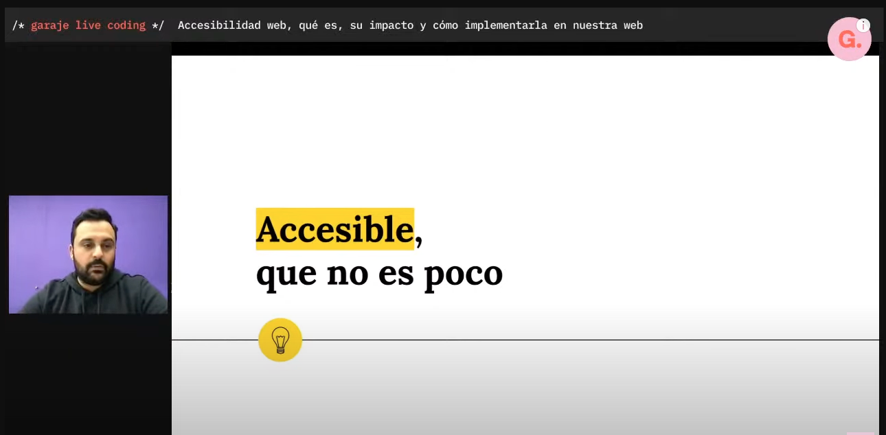

# Mejorando la accesibilidad de tu aplicación con react-testing-library 🐙

---

# WCAG

Web Content Accessibility Guidelines

---

# WCAG (Versiones)

- 1.0 _1999_
- 2.0 _2008_
- 2.1 _2018_
- **2.2 2023?**
- 3.0 ???

---

# WCAG (Principios)

- Perceptible
- Operable
- Comprensible
- Robusto

---

# WCAG (Niveles)

- A
- AA
- AAA

---

# Tipos de discapacidad

---

# Beneficios de una rampa

---

# Garaje Live Coding

Eduardo Iglesias - [🎬 Accesible, que no es poco](https://www.youtube.com/watch?v=OkBIttAqCuo)

---

# ¿Por que estamos aquí?

- Alguien ha hablado de accesibilidad
- Os he engañado yo
- Os ha engañado el organizador
  ...

---

# ¿Por que estamos aquí?

## Somos egoístas

---

# A todos nos toca

---

# Demografía española

[Pirámide poblacional INE](https://www.ine.es/covid/piramides.htm)

---

# Demografía española

## En 10 años el 25% de la población tendrá más de 65 años

---

# Miedo a la discapacidad

---

# Situaciones cotidianas

---

# Situaciones cotidianas

---

# Situaciones cotidianas

---

# Situaciones cotidianas

---

# Situaciones cotidianas

---

# Situaciones cotidianas

---

# Situaciones cotidianas

---

# WebAIM

WebAIM está formada por un equipo de expertos en accesibilidad web, que incluye desarrolladores, diseñadores, investigadores y profesionales de tecnología de la información.

---

# WebAIM Million

El report de 2023 sobre la accesibilidad de las 1.000.000 páginas de inicio más visitadas

- 49.991.225 errores diferentes
- 50 errores por página de media
- Un usuario con discapacidad por cada 21 paginas que visite se va a encontrar una con barreras de accesibilidad
- 96.3% de las páginas tienen al menos un error de accesibilidad
- **Los últimos 5 años los errores recaen en las mismas 5 categorías**

[WebAIM Million project](https://webaim.org/projects/million/)

---

# WebAIM Million

##"Addressing just these few types of issues would significantly improve accessibility across the web."

---

# WebAIM Million (Categorías)

Porcentaje de páginas encontradas con errores en cada categoría

- Bajo contraste (84%)
- Falta de textos alternativos (58%)
- Enlaces vacíos (50%)
- Falta de etiquetas de formulario (46%)
- Botones vacíos (28%)
- Falta de atributos de idioma (19%)

---

# Testing automatizado (25% - 30%)

- Atributos HTML (tabIndex, onClick, alt, title, ...)
- Atributos ARIA (aria-label, aria-labelledby, aria-describedby, ...)
- Contraste

---

# Testing automatizado

`Somos personas haciendo productos para personas`
